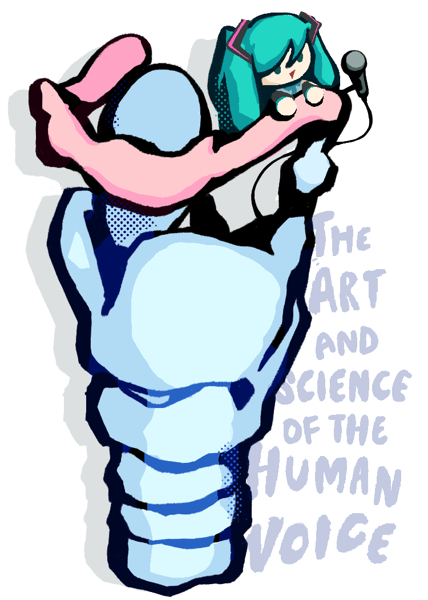

{: .home-hero }

# The Art and Science of the Human Voice
{: .no_toc }

{{ site.semester }}
{: .fs-5 .fw-300 }

Welcome to Berkeley's voice DeCal, **The Art and Science of the Human Voice (LINGUIS 198)**!

We're excited to have you here!

{: .fs-5 .fw-300 }
[Syllabus]({{ site.syllabus_url }}){: .btn .btn-primary .mr-2 target="_blank" rel="noopener" }
[Join the Discord]({{ site.discord_url }}){: .btn target="_blank" rel="noopener" }
[Course Interest Form](https://forms.gle/FQXaGa6oXkyxeNYSA){: .btn target="_blank" rel="noopener" }

---



## Course Schedule

Subject to change. Please refer to in-class announcements for weekly slides, homework assignments, and office hours.

[Skip to current week](#week-1){: .btn .btn-outline }



---

Have a question? Ask in the course Discord, or come to office hours — see the
[Staff](staff) page.
